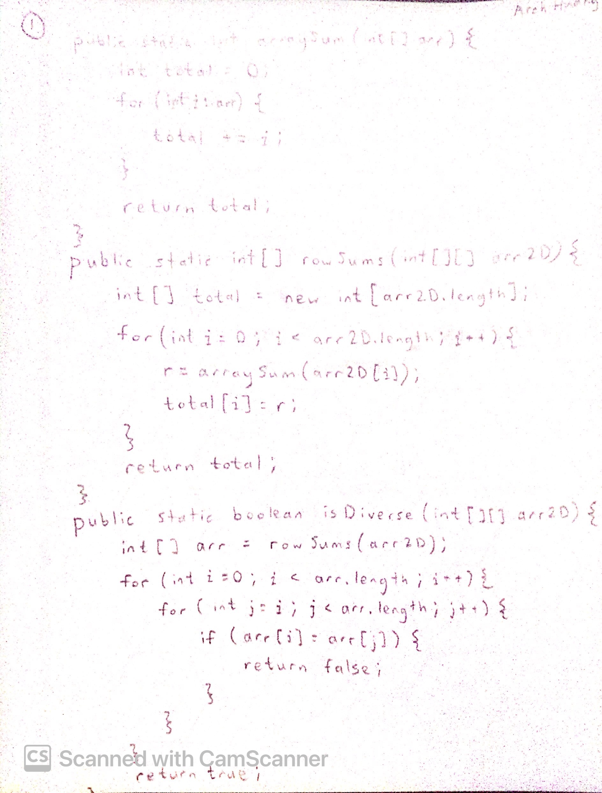
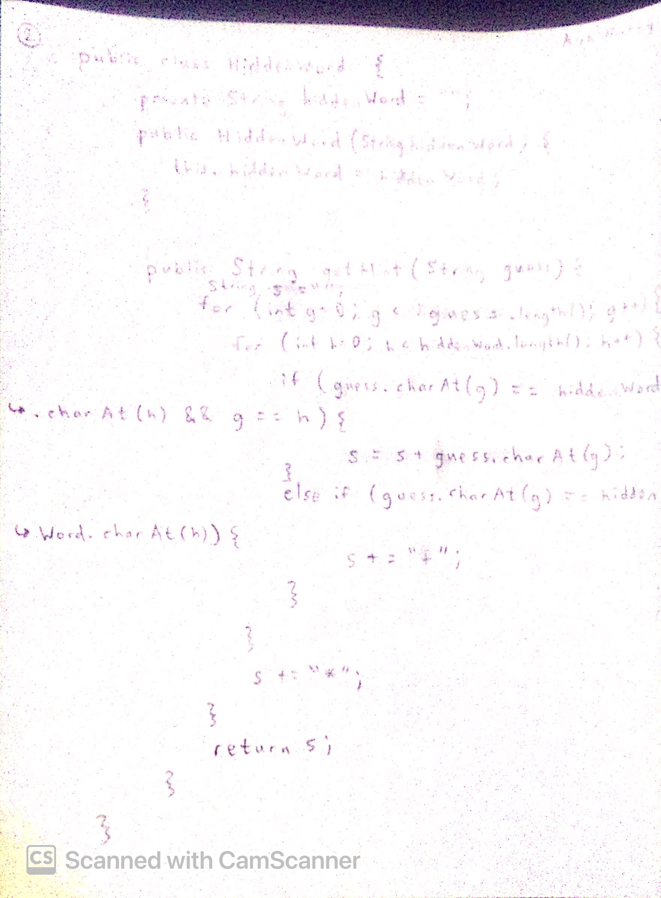

# CSA



## Week 5 - [Ticket](https://github.com/Archkitten/CS-AP-2/issues/15)

### Plan

<table>
    <tr>
        <th>Day</th>
        <td>Things to Review</td>
    </tr>
    <tr>
        <td>Monday</td>
        <td>
            1. Study Java syntax for for-loops.
             
            2. Review Array and ArrayList syntax differences.
             
            3. Increase speed for MCQs on conditional, looping, and recursive problems.
             
            4. Practice writing code on paper (No IDE or W3 schools syntax help).
             
            5. Watch out for super() class calls.
             
            6. Unit 9 MCQ Question 3 is tricky. Review it over and over again, so I don't get tricked in the future.
        </td>
    </tr>
    <tr>
        <td>Tuesday</td>
        <td>
            7. Review Truth Tables and De Morgan's Law.
             
            8. Memorize how java default libraries like substring() work.
             
            9. Study how java for-each loops work with arrays (2015 MCQ Question 22).
             
            10. Be careful when the inner nested for loop sets it's starting/stopping point based on the value of the outer for loop.
        </td>
    </tr>
    <tr>
        <td>Wednesday</td>
        <td>
            Questions Missed: None!
             
            Questions Unanswered: 23, 26 and onwards.
            

                Question 26: E
                 
                The changeIt() method isn't doing anything because there is no return type. Therefore, the start() method will print out 1 2 3 4 5 6 blackboard.
            

            

                Question 27: B
                 
                The sort is a selection sort. 1st pass: 6 and 1 get swapped. 2nd pass: 3 and 2 get swapped. 3rd pass: 3 and 5 don't get swapped. End result is 1 2 3 5 4 6.
            

            

                Question 28: B
                 
                The sort is a selection sort. It'll compare 15 times because 5 + 4 + 3 + 2 + 1. It'll swap 5 times because there are 5 pairs available to swap (5 iterations happen).
            

            

                Question 29: A
                 
                3 returns 1, 40 returns 1+1=2, 100 returns 1+1+1=3, 564 returns 1+1+1=3. It's just the number of digits.
            

            

                Question 30: B
                 
                (II) only. (I) and (III) always runs the code for 0-4 boxes.
            

            

                Question 31: E
                 
                The two starting points for X's are (1, 0) and (3, 0). Then keep creating X's one row down and one column over. So from (1, 0) the next X's would be (0, 1), and from (3, 0) the next X's would be (2, 1), (1, 2), and (0, 3).
            

            

                Question 32: B
                 
                B is the only one that correctly uses getters, treats k as an element and not as an index number, and doesn't have syntax errors.
            

        </td>
    </tr>
    <tr>
        <td>Thursday</td>
        <td>
            
            
        </td>
    </tr>
    <tr>
        <td>Friday</td>
        <td>
            

                Question 33: E
                 
                All three functions work. (I)'s Integer.MIN_VALUE sets the max to the lowest possible value beforehand, and (II) and (III) both set their max to the first index of the array.
            

            

                Question 34: D
                 
                A and C's expression use the array length minus one, which is incorrect because the for loop stopping condition is <, not <=. D is correct because the condition is when k is at the end of the array, this makes sense because we don't want to add a comma to the last word.
            

            

                Question 35: C
                 
                Binary search will get 5 as the index value of the first "8" found.
            

            

                Question 36: D
                 
                Binary search 2000 values is 2^11.
            

            

                Question 37: E
                 
                (II) is correct, prints out from the end of the array to 2. (III) reverses the array first, then prints out from front to 2, so it is also correct.
            

            

                Question 38: C
                 
                k is the counter counting the number of times v == nums[numVals - 1].
            

            

                Question 39: C
                 
                Apparently ArrayList's .set() function will return the value that it was trying to replace. So Alice Bob Carl will print out in the first for loop while everything gets set to Alex, so the second for loop prints out Alex Alex Alex.
            

            

                Question 23: C
                 
                j = 1
                 
                k j _ _ _
                 
                Input: 5 4 3 2 1
                 
                Output: 5 5 3 2 1
                 
                (k = -1 so while loop breaks out)
                 
                Final Result of (j = 1): 4 5 3 2 1
                 
                j = 2
                 
                _ k j _ _
                 
                Input: 4 5 3 2 1
                 
                Output: 4 5 5 2 1
                 
                k _ j _ _
                 
                Input: 4 5 5 2 1
                 
                Output: 4 4 5 2 1
                 
                (k = -1 so while loop breaks out)
                 
                Final Result of (j = 2): 3 4 5 2 1
            

        </td>
    </tr>
</table>

### Self Study Guide

<a href="https://archkitten.github.io/CS-AP-2/csa/csa_study_guide" class="btn">Study Guide</a>
