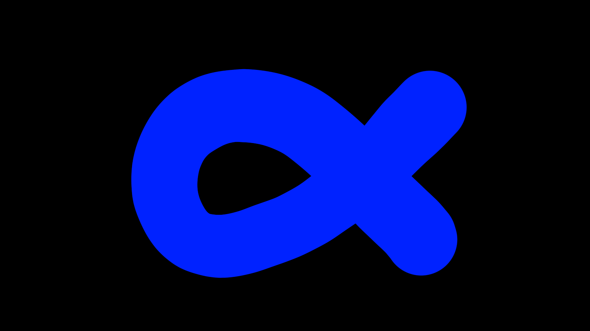



<!-- PAGE CONTENT STARTS HERE -->

<h1 style="color:white; text-align:center;">Unwind Arcadia</h1>

    

        
        <h6 style="color:white">Flyby Fishing</h6>
    

    

        
        <h6 style="color:white">Untitled</h6>
    

    

        
        <h6 style="color:white">Untitled</h6>
    

    

        
        <h6 style="color:white">Untitled</h6>
    

    

        
        <h6 style="color:white">Untitled</h6>
    

    

        
        <h6 style="color:white">Untitled</h6>
    

